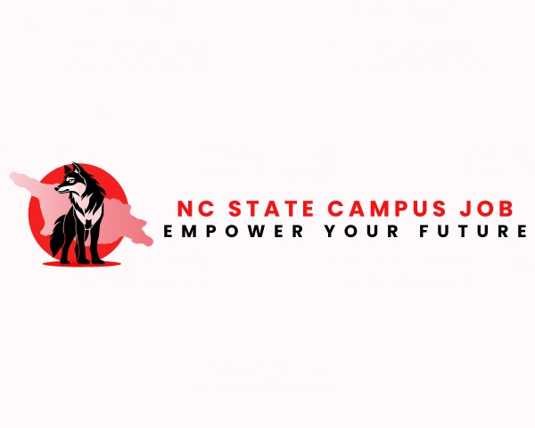

<h3 align="center">
Empower Your Future: Find Your Campus Opportunity with NCSU!
</h3>

<p align="center">
  <picture>
    
  </picture>
</p>

<div align="center">
   
  
  
  
  
  
</div>

<div align="center">
  
  [](https://codecov.io/gh/bhandariprerak/ncsu-campus-jobs-review-system)
  [](https://github.com/fantastic-riddles/NCSU_Campus_Jobs_Review_System_2.0/main/LICENSE)
  [](https://github.com/fantastic-riddles/NCSU_Campus_Jobs_Review_System_2.0/graphs/contributors)
  [](https://github.com/fantastic-riddles/NCSU_Campus_Jobs_Review_System_2.0/search?l=python)
  [](https://github.com/fantastic-riddles/NCSU_Campus_Jobs_Review_System_2.0/issues)
  [](https://img.shields.io/github/repo-size/fantastic-riddles/NCSU_Campus_Jobs_Review_System_2.0.svg)
[](https://github.com/fantastic-riddles/NCSU_Campus_Jobs_Review_System_2.0/actions/runs/11639944138)
[](https://github.com/fantastic-riddles/NCSU_Campus_Jobs_Review_System_2.0/actions/runs/11639944138)
[](https://github.com/fantastic-riddles/NCSU_Campus_Jobs_Review_System_2.0/actions/runs/11639944138)
  
  [](https://doi.org/10.5281/zenodo.14026618)
  

</div>

<h2></h2>

<br>

The NCSU Campus Job Review System is a dynamic Flask application designed to empower students at North Carolina State University by providing a platform for reviewing campus job opportunities. By sharing experiences and insights, students can make informed decisions about job applications, enhancing their understanding of available roles. This comprehensive system not only supports students in their job search but also enables employers to connect with potential candidates, creating a vibrant campus employment community.


https://github.com/user-attachments/assets/8fbaf56c-5cf4-4b41-9713-47709cf2270a


<a href="https://ncsu-campus-jobs-review-system-2-0.onrender.com/">Link to our live page!!</a>

#### Key Enhancements

- **User-Friendly Reviews**: Users can anonymously submit and read reviews about various on-campus jobs, fostering a transparent environment for honest feedback.
- **Upvote Reviews**: Users can upvote a review, fostering a helpful and transparent environment for everybody.
- **Safe Review**: Reviews posted by users are filtered and inappropriate words (if any) present in them are removed. This keeps a clean and safe platform to share reviews.
- **Enhanced Accessibility**: The application is hosted on Platform Render, ensuring easy access for all users.
- **Dockerized for Deployment**: With a containerized setup using Docker, the application is easy to deploy and manage, streamlining updates and maintenance.
- **Email Notifications**: New users receive a welcome email with their credentials upon signing up, ensuring a smooth onboarding process.
- **Job Alerts**: Users receive a job alert email every time a new job is posted to keep them updated with latest postings.
- **Secure Login and Signup**: A robust login and signup system protects user information while maintaining security.
- **Job Application Feature**: Users can apply for jobs directly through the platform, simplifying the process of securing employment.
- **Employer Interface**: Employers can post job openings and manage applications efficiently through a dedicated employer page.
- **Admin Dashboard**: An admin functionality allows for monitoring and moderation of the application, including the ability to manage inappropriate content.
- **Engaging About Us and Contact Us Pages**: Updated pages provide clear information about the platform and enhance user engagement.


<br>
<br>

### Why use our application? # TODO: change this link
[](https://youtu.be/D8kcTJBJ-TA)


### Documentation 

Comprehensive documentation is available to guide you through setup, usage, and troubleshooting. It includes detailed information on features, APIs, and best practices to help you make the most of this project.

[Access the full documentation here.](https://fantastic-riddles.github.io/NCSU_Campus_Jobs_Review_System_2.0/app/models.html)

<br>
<br>

### Pre-requisites
<h2></h2>

To run these scripts, you will need Python installed on your PC. Please visit [Python Installers](https://www.python.org/downloads/) to download the latest version of Python. 


Alternatively, if you just want to play around with the application without installing Python, you can use the provided Docker image. This allows you to run the application in a containerized environment.

#### Option 1: Running Locally with Python
1. Install Python.
2. Other requirements can be installed using `requirements.txt`.

#### Option 2: Running with Docker
1. Make sure you have [Docker](https://www.docker.com/get-started) installed on your machine.
2. Pull the Docker image using the following command:
   ```bash
   docker pull vihar2712/ncsu-campus-jobs:latest
   ```
3. Run the Docker container:
  ```docker run -it -p 5000:5000 -e EMAIL_API_KEY=your_api_key_here -e EMAIL_ADDRESS=sender_email vihar2712/ncsu-campus-jobs:latest```
4. Access the application at ```http://127.0.0.1:5000/```

<br>
<br>

### Installation 

<h2></h2>
Initially you can check whether your system has python pre-installed or not, usually nowadays in most of the systems, be it Windows or MacOS, python is pre-installed. 

To check whether you have python installed or not, you can open CMD or a Terminal and run the command "python --version". If the CMD shows the version such as Python 3.6.7 then your system already has python installed and you just need to clone the repository and run the python scripts. 

If this is not the case, then you need to download python installer package from [Python Installers](https://www.python.org/downloads/) based on your system's operating system and install it and you can further clone this repository to execute the scripts.

You can refer [INSTALL.md](https://github.com/fantastic-riddles/NCSU_Campus_Jobs_Review_System_2.0/blob/feature/readme-badges/INSTALL.md) for the complete installation steps based on your OS.

<br>
<br>


### API Key from SendGrid 
<h2></h2>
To use SendGrid for sending emails, you'll need to create an API key. Follow these steps to get started:

1. [Sign up for SendGrid](#sign-up-for-sendgrid)
2. [Create an API key](#create-an-api-key)
3. [Save your API key](#save-your-api-key)
4. [Additional Resources](#additional-resources)

#### Sign Up for SendGrid

1. Go to the [SendGrid Sign Up page](https://signup.sendgrid.com/) and create an account.
2. Fill in the required information, including your email, password, and company details.
3. Verify your email address through the confirmation email sent by SendGrid.

#### Create an API Key

1. Once logged in, navigate to the **Settings** menu in the left sidebar.
2. Click on **API Keys**.
3. Click on the **Create API Key** button.
4. Enter a name for your API key (e.g., "My App API Key").
5. Set the permissions for the API key based on your needs (Full Access is recommended for development purposes).
6. Click **Create & View** to generate your API key.

#### Save Your API Key

1. Copy the API key and store it securely. You won't be able to see it again after you navigate away from this page.
2. Use this API key in your application to authenticate with the SendGrid API.

#### Additional Resources

- [SendGrid Documentation](https://docs.sendgrid.com/)
- [SendGrid API Key Best Practices](https://docs.sendgrid.com/api-reference/api-keys)

<br>
<br>

### Docker setup  
<h2></h2>

1. [Prerequisites](#prerequisites)
2. [Steps to Build and Run the Application](#steps-to-build-and-run-the-application)
   - [Clone the Repository](#clone-the-repository)
   - [Build the Docker Image](#build-the-docker-image)
   - [Run the Docker Container](#run-the-docker-container)
   - [Access the Application](#access-the-application)
3. [Troubleshooting](#troubleshooting)
4. [Additional Resources](#additional-resources)

#### Prerequisites

1. **Install Docker**: Ensure you have Docker installed on your machine. You can download it from [Docker's official website](https://www.docker.com/get-started).

2. **Docker Hub Account**: Optional, but useful if you want to push your Docker images to a repository.

#### Steps to Build and Run the Application

##### Clone the Repository

If you haven’t already, clone the application repository to your local machine.

```bash
git clone https://github.com/fantastic-riddles/NCSU_Campus_Jobs_Review_System_2.0.git
cd NCSU_Campus_Jobs_Review_System_2.0
```

##### Build the Docker Image

Use the following command to build the Docker image. Replace `ncsu-campus-jobs` with the desired image name.

```bash
docker build -t ncsu-campus-jobs .
```

##### Run the Docker Container

To run the application, you need to provide your email API key and email address as environment variables. Replace `your_api_key_here` and `sender_email` with your actual credentials. your `your_api_key_here` is the key you created using Sendgrid.

```bash
docker run -it -p 5000:5000 -e EMAIL_API_KEY=your_api_key_here -e EMAIL_ADDRESS=sender_email ncsu-campus-jobs
```

##### Access the Application

Once the container is running, you can access the application by navigating to `http://localhost:5000` in your web browser.

#### Troubleshooting

- **Docker Not Running**: Ensure that Docker Desktop (or your Docker service) is running on your machine.
- **Port Conflicts**: If port 5000 is already in use, you can change the port mapping in the `docker run` command (e.g., `-p 8080:5000`).
- **Logs**: If the application fails to start, check the logs for any error messages. You can view logs with the following command:

  ```bash
  docker logs <container-id>
  ```

#### Additional Resources

- [Docker Documentation](https://docs.docker.com/)
- [Docker Hub](https://hub.docker.com/)

<br>
<br>

### Contributors 
<h2></h2>

We'd like to thank the following contributors for their valuable input and enhancements to this project:

- [Prerak Bhandari](https://github.com/bhandariprerak) - [bhandariprerak@gmail.com](mailto:bhandariprerak@gmail.com)
- [Akshat Shah](https://github.com/akshatrshah) - [akshatrshah@gmail.com](mailto:akshatrshah@gmail.com)
- [Dhairya Shah](https://github.com/scooby3000) - [dhairya3000@gmail.com](mailto:dhairya3000@gmail.com)


#### Acknowledgements

This project was forked from [NCSU CAMPUS JOBS REVIEW SYSTEM](https://github.com/Rmv-se-510/NCSU_Campus_Jobs_Review_System_2.0) and has been enhanced with additional features and improvements. Special thanks to the original authors for their foundational work.
